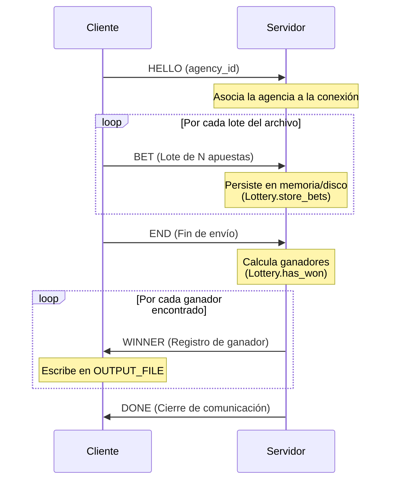

# Implementación General

## Protocolo de comunicación

Se implementó un protocolo binario propio sobre **TCP**, con serialización compacta y lecturas/escrituras robustas para prevenir lecturas y escrituras parciales (_short read_ y _short write_).

Los mensajes se arman y parsean manipulando directamente arreglos de bytes (`bytearray` / `[]byte`). Ambos lados comparten el mismo formato binario y usan `encoding/binary` (Go) o `int.to_bytes`/`int.from_bytes` (Python) para asegurar la codificación de enteros en _Big-Endian_, garantizando la compatibilidad entre ambos entornos independientemente de la arquitectura del procesador.

### Framing

Todo mensaje viaja dentro de un frame el cual, para resolver la delimitación de mensajes (_frame boundaries_), usa **Length-Prefixed Framing**. La estructura entonces es:

```
[4 bytes big-endian: largo del payload][payload]
```

El largo permite al receptor saber exactamente cuántos bytes leer del socket antes de empezar a interpretar el contenido, evitando tener que "adivinar" límites de mensaje a partir de separadores.

El payload, a su vez, sigue un esquema **Tag-Length-Value (TLV)**:

```
[1 byte: tipo de mensaje][campo]*
```

Donde cada campo de longitud variable se serializa como:

```
[4 bytes big-endian: largo del campo][bytes del campo en utf-8]
```

Este esquema de longitud prefijada garantiza que los datos variables(como nombres o apellidos con comas, espacios o caracteres especiales) no rompan el parseo del protocolo.

### Tipos de mensajes

El `agency_id` se anuncia una única vez al inicio de la conexión mediante el mensaje **`HELLO`**. A partir de ese momento la agencia queda asociada a la conexión, por lo que los mensajes `BET` y `END` no vuelven a transportarlo (evitando redundancia en cada paquete).

> **Nota:** Antes el `agency_id` se enviaba dentro de cada mensaje `BET` (y en el `END`). Como todas las apuestas de una misma conexión pertenecen siempre a la misma agencia, hacer esto resultaba redundante e ineficiente. Por eso se agregó el mensaje `HELLO` para anunciar el `agency_id` una sola vez y asociarlo a la conexión, dejando un protocolo más limpio y económico.

| Tipo                 | Identificador | Dirección          | Campos                                                                                                             |
| :------------------- | :-----------: | :------------------ | :----------------------------------------------------------------------------------------------------------------- |
| **`HELLO`**  |   `0x01`   | Cliente → Servidor | `agency_id` (se envía una sola vez, antes de las apuestas).                                                     |
| **`BET`**    |   `0x02`   | Cliente → Servidor | **Lote de apuestas.** Contiene $N$ apuestas compuestas por `nombre, apellido, DNI, nacimiento, número`. |
| **`END`**    |   `0x03`   | Cliente → Servidor | (sin campos)                                                                                                       |
| **`WINNER`** |   `0x04`   | Servidor → Cliente | `nombre, apellido, DNI, nacimiento, número`.                                                                    |
| **`DONE`**   |   `0x05`   | Servidor → Cliente | (sin campos)                                                                                                       |

#### Diagrama de flujo de datos



### Envío y recepción de bytes (_short read_ / _short write_)

Ni `socket.send`/`recv` (Python) ni `Write`/`Read` de `io.Writer`/`io.Reader` (Go) garantizan escribir o leer la totalidad de los bytes pedidos en una sola llamada.

Para abstraer esta complejidad, toda la comunicación se delega en el módulo `safe_socket` provisto por la cátedra (`SendAll`/`RecvAll` en Go, `send_all`/`recv_all` en Python). Este módulo reintenta en bucle las operaciones hasta completar de forma exacta la cantidad de bytes requerida, abortando con un error solo si la conexión se interrumpe o se cierra.

> El módulo `protocol` nunca llama directamente a los sockets de TCP; siempre pasa por `safe_socket`.

### Algoritmo de Nagle

Apenas se establece la conexión, el cliente deshabilita el algoritmo de Nagle sobre el socket TCP (`tcpConn.SetNoDelay(true)` en Go).

El algoritmo de Nagle busca reducir la cantidad de segmentos pequeños en la red: retiene los datos a enviar y los acumula hasta juntar un segmento grande o hasta recibir el _ACK_ de los datos previos. Esto introduce latencia y, en nuestro caso, distorsiona la relación entre un _batch_ lógico y su transmisión: varios lotes podrían fusionarse en un mismo segmento, o un lote quedar demorado a la espera de un _ACK_.

Al deshabilitarlo, cada frame (el _length-prefix_ más su payload) se entrega al sistema operativo para su envío inmediato, sin esperas. De esta forma el tamaño del paquete transmitido escala de forma directa con el `BATCH_SIZE` configurado, que es justamente el comportamiento buscado por el procesamiento por lotes del ejercicio 6.

> El _framing_ con longitud prefijada del protocolo hace que deshabilitar Nagle sea seguro: el receptor delimita los mensajes por el largo anunciado, no por los límites de los segmentos TCP, así que no importa cómo la red fragmente o agrupe los bytes.

## Concurrencia y sincronización

El servidor atiende a las agencias de forma **concurrente** mediante `threading`: por cada conexión aceptada se lanza un thread dedicado (`_handle_client`) que recibe las apuestas, espera el quorum y responde los ganadores. Los threads se conservan en una lista (`self._threads`) para poder unirlos ordenadamente durante el cierre. Dado que el trabajo de cada thread es fundamentalmente de I/O (sockets y disco), las limitaciones del [GIL](https://wiki.python.org/moin/GlobalInterpreterLock) no presentan un cuello de botella real.

### Barrera de quorum (`Condition` + contador)

El sorteo no puede realizarse hasta que un mínimo de agencias (`AGENCY_QUORUM_MIN`) haya notificado el fin de su envío. Para coordinar esta espera se usa un `threading.Condition` junto a un contador (`_agencies_done`):

1. Cada agencia, al recibir su `END`, incrementa el contador dentro de la sección protegida por la `Condition`.
2. Si con ese incremento se alcanza el quorum, ese thread realiza el sorteo **una única vez** y despierta al resto con `notify_all()`.
3. Si aún no se alcanza, el thread espera con `wait()` (dentro de un `while` que revalida la condición para protegerse de _spurious wakeups_).
4. Las agencias que lleguen **después** de alcanzado el quorum no se bloquean: pasan de largo directamente.

> [!NOTE]
> Elegí utilizar `Condition` + contador en lugar de `threading.Barrier` porque la barrera libera exactamente _N_ threads y se resetea. Es decir, las agencias que excedan el quorum quedarían bloqueadas esperando un ciclo que nunca se completa. En cambio, con el contador, la condición "*agencias finalizadas ≥ quorum*" queda cumplida de forma permanente, por lo que las que llegan después del quorum la ven satisfecha y continúan sin bloquearse.

### Protección de la sección crítica (`Lock`)

Todas las agencias comparten el mismo almacenamiento de apuestas (`Lottery`, que persiste en un archivo CSV). Un único `threading.Lock` (`_storage_lock`) protege **todos** los accesos a ese archivo:

- Cada llamada a `store_bets` (escritura) se realiza dentro del lock, serializando las escrituras concurrentes de distintas agencias.
- La lectura del sorteo (`_compute_winners`) también se realiza dentro del mismo lock. Como es un lock mutuamente exclusivo, la lectura nunca se solapa con una escritura: si una agencia ajena al quorum aún estuviera cargando apuestas, o bien termina antes de que empiece la lectura, o bien queda a la espera hasta que la lectura concluya.

> [!IMPORTANT]
> No se asume que al alcanzarse el quorum ya no ingresen más datos; la exclusión mutua es la que garantiza la consistencia entre lecturas y escrituras.

### Sorteo: una única lectura, particionada por agencia

El sorteo se resuelve con **una sola pasada** sobre el almacenamiento, disparada por el thread que alcanza el quorum y compartida por todos los demás (el resultado se guarda en `_winners_by_agency`). Esto evita releer el archivo una vez por cada agencia.

`_compute_winners` recorre las apuestas con `load_bets` de forma perezosa (línea a línea, sin cargar todo el archivo en memoria) y, aplicando `has_won`, agrupa en un diccionario `agency_id → [ganadores]` únicamente las apuestas ganadoras, que son intrínsecamente pocas. Como las agencias que forman el quorum ya terminaron de escribir antes de contar para él, sus ganadores resultan completos y deterministas.

Finalmente, cada thread responde a su agencia **solo** con los ganadores que le corresponden (`_send_winners`), evitando cualquier _broadcast_: los ganadores presentes en un `OUTPUT_FILE` siempre provienen del `INPUT_FILE` de esa misma agencia.

## Graceful shutdown (SIGTERM)

Ambos procesos manejan la señal `SIGTERM` (y `SIGINT`) para terminar de forma ordenada, liberando todos sus recursos y saliendo con código 0 en un tiempo acotado, en cualquier etapa de la comunicación.

### Servidor

El manejo se apoya en un `threading.Event` (`_shutdown`) y en el cierre del socket de escucha:

1. Un handler registrado con el módulo `signal` marca `_shutdown` y **cierra el socket de escucha**. Cerrar el socket hace que el `accept()` bloqueante del thread principal lance `OSError`, que se interpreta como cierre esperado (no como error) y corta el bucle de aceptación.
2. El mismo handler hace `notify_all()` sobre la `Condition` del quorum. Así, las agencias que hubieran quedado esperando el sorteo (quorum no alcanzado) despiertan, detectan el flag de shutdown y cierran su conexión sin responder ganadores.
3. Antes de finalizar, el thread principal hace `join()` de todos los threads de clientes en curso, garantizando que ningún recurso quede abierto al salir.

Los sockets de cada cliente se cierran mediante el `with client_socket` de su thread; el socket de escucha se cierra en el handler y por el `with` de `run`.

### Cliente

El cliente usa `signal.NotifyContext` para derivar un `context` que se cancela ante la señal:

1. Durante los reintentos de conexión, la espera entre intentos se hace con un `select` sobre `ctx.Done()` y un temporizador, de modo que la señal aborta la reconexión de inmediato en lugar de agotar los reintentos.
2. Durante el intercambio de mensajes, una goroutine espera la cancelación del contexto y **cierra la conexión**, lo que desbloquea cualquier lectura o escritura pendiente sobre el socket. Esa goroutine se libera al finalizar `Run` mediante el cierre de un canal `done`.
3. Como el cierre se produce por la señal, el error resultante del socket no se trata como fallo: si el contexto fue cancelado, `run` retorna código 0. Al salir por retorno (y no por `exit` abrupto), los `defer` de cierre de archivos y conexión se ejecutan normalmente.
