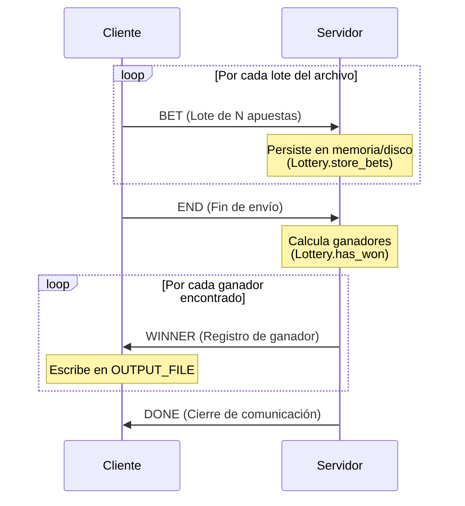

# Implementación General

## Protocolo de comunicación

Se implementó un protocolo binario propio sobre **TCP**, con serialización compacta y lecturas/escrituras robustas para prevenir lecturas y escrituras parciales (_short read_ y _short write_).

Los mensajes se arman y parsean manipulando directamente arreglos de bytes (`bytearray` / `[]byte`). Ambos lados comparten el mismo formato binario y usan `encoding/binary` (Go) o `int.to_bytes`/`int.from_bytes` (Python) para asegurar la codificación de enteros en _Big-Endian_, garantizando la compatibilidad entre ambos entornos independientemente de la arquitectura del procesador.

### Framing

Todo mensaje viaja dentro de un frame el cual, para resolver la delimitación de mensajes (_frame boundaries_), usa **Length-Prefixed Framing**. La estructura entonces es:

```
[4 bytes big-endian: largo del payload][payload]
```

El largo permite al receptor saber exactamente cuántos bytes leer del socket antes de empezar a interpretar el contenido, evitando tener que "adivinar" límites de mensaje a partir de separadores.

El payload, a su vez, sigue un esquema **Tag-Length-Value (TLV)**:

```
[1 byte: tipo de mensaje][campo]*
```

Donde cada campo de longitud variable se serializa como:

```
[4 bytes big-endian: largo del campo][bytes del campo en utf-8]
```

Este esquema de longitud prefijada garantiza que los datos variables(como nombres o apellidos con comas, espacios o caracteres especiales) no rompan el parseo del protocolo.

### Tipos de mensajes

| Tipo | Identificador | Dirección | Campos |
| :--- | :---: | :--- | :--- |
| **`BET`** | `0x01` | Cliente → Servidor | **Lote de apuestas.** Contiene el `agency_id` seguido de $N$ apuestas compuestas por `nombre, apellido, DNI, nacimiento, número`. |
| **`END`** | `0x02` | Cliente → Servidor | `agency_id` |
| **`WINNER`** | `0x03` | Servidor → Cliente | `nombre, apellido, DNI, nacimiento, número`. |
| **`DONE`** | `0x04` | Servidor → Cliente | (sin campos) |

#### Diagrama de flujo de datos



### Envío y recepción de bytes (_short read_ / _short write_)

Ni `socket.send`/`recv` (Python) ni `Write`/`Read` de `io.Writer`/`io.Reader` (Go) garantizan escribir o leer la totalidad de los bytes pedidos en una sola llamada.

Para abstraer esta complejidad, toda la comunicación se delega en el módulo `safe_socket` provisto por la cátedra (`SendAll`/`RecvAll` en Go, `send_all`/`recv_all` en Python). Este módulo reintenta en bucle las operaciones hasta completar de forma exacta la cantidad de bytes requerida, abortando con un error solo si la conexión se interrumpe o se cierra.

> El módulo `protocol` nunca llama directamente a los sockets de TCP; siempre pasa por `safe_socket`.